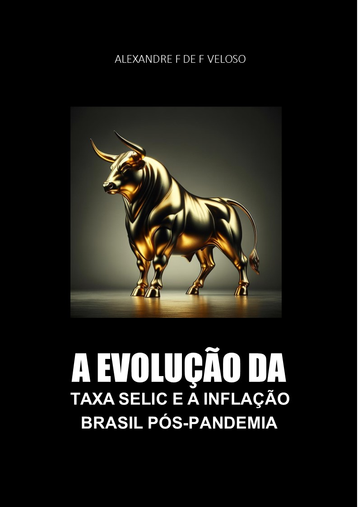

-------

# Projeto EBOOK Gerado por I.A.s

 > ℹ️ **NOTE:** Este é o repositório desenvolvido durante o curso no qual fui instrutor técnico na plataforma da [DIO](https://dio.me)

Projeto com o objetivo de gerar um ebook digital com as facilidades das ferramentas de IA. todos os prompts
seguem abaixo.

<a href="https://github.com/AFVELOSO13/e-book-prompt/blob/main/output/Ebook Selic.pdf" title="View PDF now"> 📕Clique aqui para ler</a>

## 💻 Tecnologias utilizadas no projeto

- [ChatGPT](https://chat.openai.com/) 
- [ChatGPT 4o Mini](https://chat.openai.com/)
- [PowerPoint](https://www.microsoft.com/en/microsoft-365/powerpoint)

## 🧠 Prompts

ChatGPT：

|   Ação   | prompt                                                                                                                                                                                                                                                                         |
| :------: | ------------------------------------------------------------------------------------------------------------------------------------------------------------------------------------------------------------------------------------------------------------------------------ |
|  título  | Quero fazer um ebook sobre a taxa selic e a inflação do Brasil desde 2020 até os dias de hoje em cinco capítulos.                                                        |
| conteúdo | Desenvolva cada capítulo do e-book |

ChatGPT 4o Mini：

|  Ação  | prompt                                                                                 |
| :----: | -------------------------------------------------------------------------------------- |
| título | Generate an image of the bull that represents finance. use golden tones with black style --v 5.1 |

## ✨ Features

- Conteúdo gerado via ChatGPT
- Imagens geradas via ChatGPT 4o Mini

## 📚 Materiais

- Imagens utilizadas em `assets`
- ebook gerado durante as aulas em `output`

## 🛠️ Instruções de execução

Utilize os prompts acima nas ferramentas sugeridas para gerar o material base e utilize uma ferramenta de edição de documentos como power point, libreoffice , indesign para diagramação.

## 👨‍💻 Expert

   
    
&nbsp&nbsp&nbspAlexandre F. F. Veloso 
    &nbsp&nbsp&nbsp
    <a href="https://github.com/AFVELOSO13">
    GitHub</a>&nbsp;|&nbsp;
    
&nbsp;|&nbsp;

  

---

⌨️ com 💜 por [Alexandre F. F. Veloso](https://github.com/AFVELOSO13)
